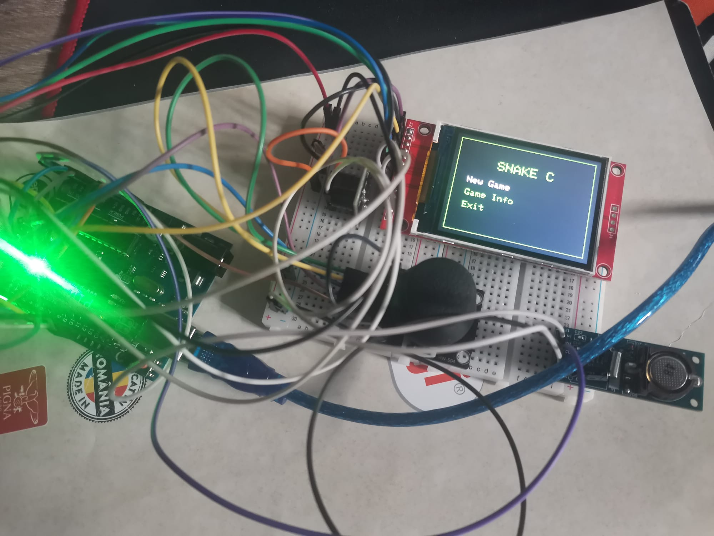
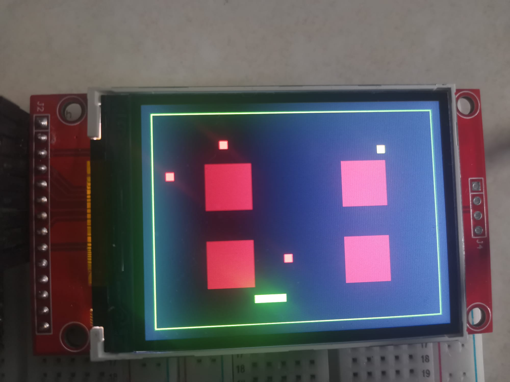

# PM Project - SnakeC

SnakeC, made in Arduino IDE.

[Project implementation (OCW) (ro)](https://ocw.cs.pub.ro/courses/pm/prj2026/bianca.popa1106/eugen.munteanu2604)

[Demo Video (Drive) (ro)](https://drive.google.com/file/d/1VmP7aFrW3ddQStOhkZPjp0pJmqlmSku8/view?usp=sharing)

